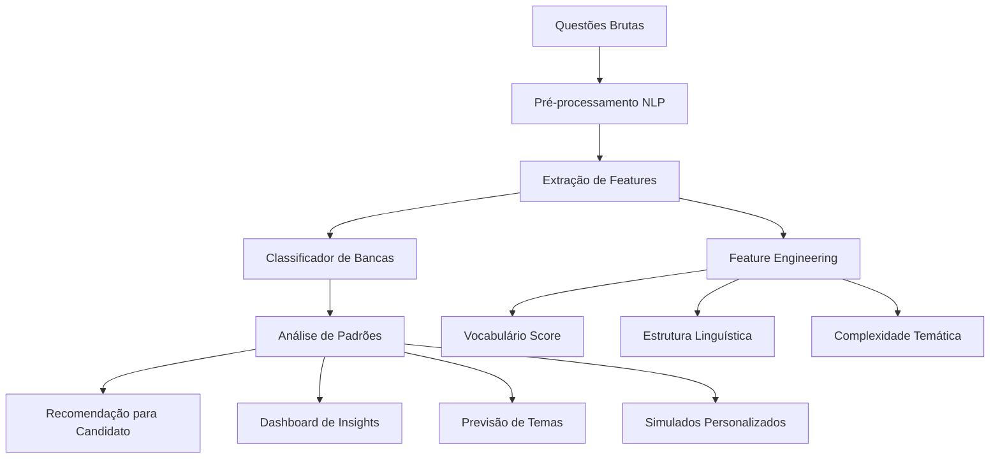

# 🏛️ ANÁLISE DAS 3 PRINCIPAIS BANCAS DE CONCURSOS

## 📊 **OVERVIEW EXECUTIVO**

Este documento detalha a análise estratégica das 3 principais bancas organizadoras de concursos públicos no Brasil, seus padrões, características e como a IA do ConcursAI irá analisá-las.

---

## 🎯 **CRITÉRIOS DE SELEÇÃO DAS BANCAS**

### **Métricas de Priorização:**
1. **Volume de Concursos:** Quantidade anual de certames
2. **Relevância Nacional:** Abrangência geográfica  
3. **Diversidade de Cargos:** Variedade de áreas cobertas
4. **Padrão de Questões:** Estilo único identificável por IA
5. **Impact Score:** Número de candidatos impactados

### **Ranking Final:**
| Posição | Banca | Score | Justificativa |
|---------|-------|-------|---------------|
| 🥇 | **CESPE/CEBRASPE** | 95/100 | Maior volume, padrão único, relevância nacional |
| 🥈 | **FCC** | 88/100 | Tradição, diversidade, padrão bem definido |
| 🥉 | **FGV** | 82/100 | Modernidade, crescimento, estilo analítico |

---

## 🏛️ **1. CESPE/CEBRASPE**

### **📋 Perfil Institucional**
- **Nome Completo:** Centro Brasileiro de Pesquisa em Avaliação e Seleção e de Promoção de Eventos
- **Fundação:** 1993
- **Sede:** Brasília/DF
- **Especialidade:** Concursos de alto nível, cargos estratégicos

### **📊 Características Quantitativas**
- **Concursos/Ano:** ~150 certames
- **Candidatos/Ano:** ~2 milhões de inscrições
- **Áreas Principais:** Tribunais, Polícia Federal, Ministérios, Universidades
- **Cargos Típicos:** Analista Judiciário, Delegado, Auditor, Professor

### **🧠 Padrão de IA Identificado**

#### **Estilo de Questões:**
- ✅ **Questões Longas:** Média de 8-12 linhas por questão
- ✅ **Interpretativas:** Exige análise profunda do enunciado  
- ✅ **Certo/Errado:** Formato predominante (80% das questões)
- ✅ **Pegadinhas Sutis:** Detalhes que podem confundir
- ✅ **Legislação Atual:** Sempre atualizada e específica

#### **Temas Mais Cobrados (IA Analysis):**
```json
{
  "direito_constitucional": 25.3,
  "direito_administrativo": 22.1, 
  "português": 18.7,
  "raciocínio_lógico": 12.4,
  "conhecimentos_específicos": 21.5
}
```

#### **Padrões Linguísticos (NLP):**
- **Vocabulário:** Técnico-jurídico formal
- **Estrutura:** Períodos compostos longos
- **Armadilhas:** Negativas duplas, "exceto", "incorreto"
- **Contextualização:** Situações práticas do serviço público

### **🎯 Estratégia IA para CESPE:**
```python
# Exemplo de análise de padrão CESPE
def analyze_cespe_pattern(question_text):
    patterns = {
        'length': len(question_text.split()) > 50,
        'has_except': 'exceto' in question_text.lower(),
        'has_incorrect': 'incorret' in question_text.lower(), 
        'formal_language': formal_vocabulary_score(question_text) > 0.8,
        'legal_context': legal_terms_count(question_text) > 3
    }
    return calculate_cespe_probability(patterns)
```

---

## 🏢 **2. FCC (FUNDAÇÃO CARLOS CHAGAS)**

### **📋 Perfil Institucional**
- **Nome Completo:** Fundação Carlos Chagas
- **Fundação:** 1964
- **Sede:** São Paulo/SP
- **Especialidade:** Concursos técnicos, carreiras consolidadas

### **📊 Características Quantitativas**
- **Concursos/Ano:** ~120 certames
- **Candidatos/Ano:** ~1.5 milhões de inscrições
- **Áreas Principais:** Tribunais de Contas, Prefeituras, Empresas Públicas
- **Cargos Típicos:** Técnico Judiciário, Fiscal, Analista Contábil

### **🧠 Padrão de IA Identificado**

#### **Estilo de Questões:**
- ✅ **Questões Diretas:** Média de 4-6 linhas por questão
- ✅ **Objetivas:** Foco no conhecimento direto
- ✅ **Múltipla Escolha:** Formato predominante (A-E)
- ✅ **Práticas:** Aplicação direta dos conceitos
- ✅ **Conhecimento Consolidado:** Menos mudanças legislativas

#### **Temas Mais Cobrados (IA Analysis):**
```json
{
  "conhecimentos_específicos": 35.2,
  "português": 20.1,
  "direito_administrativo": 15.8,
  "matemática_raciocínio": 14.3,
  "informática": 14.6
}
```

#### **Padrões Linguísticos (NLP):**
- **Vocabulário:** Técnico-profissional acessível
- **Estrutura:** Períodos simples e diretos
- **Clareza:** Enunciados objetivos sem ambiguidade
- **Aplicação:** Situações práticas do cotidiano profissional

### **🎯 Estratégia IA para FCC:**
```python
# Exemplo de análise de padrão FCC
def analyze_fcc_pattern(question_text):
    patterns = {
        'conciseness': len(question_text.split()) < 40,
        'direct_question': ends_with_question_mark(question_text),
        'technical_terms': technical_vocabulary_score(question_text) > 0.7,
        'practical_context': practical_situation_detected(question_text),
        'multiple_choice': has_alternatives_pattern(question_text)
    }
    return calculate_fcc_probability(patterns)
```

---

## 🎓 **3. FGV (FUNDAÇÃO GETÚLIO VARGAS)**

### **📋 Perfil Institucional**
- **Nome Completo:** Fundação Getúlio Vargas
- **Fundação:** 1944 (concursos desde 2000)
- **Sede:** Rio de Janeiro/RJ
- **Especialidade:** Concursos modernos, cargos analíticos

### **📊 Características Quantitativas**
- **Concursos/Ano:** ~80 certames
- **Candidatos/Ano:** ~1 milhão de inscrições
- **Áreas Principais:** Empresas Públicas, Autarquias, Ministérios
- **Cargos Típicos:** Analista, Consultor, Especialista, Gestor

### **🧠 Padrão de IA Identificado**

#### **Estilo de Questões:**
- ✅ **Questões Analíticas:** Média de 6-8 linhas por questão
- ✅ **Conceituais:** Foco em entendimento profundo
- ✅ **Múltipla Escolha:** Formato moderno (A-E)
- ✅ **Inovadoras:** Temas atuais e tendências
- ✅ **Raciocínio Lógico:** Alto peso em análise

#### **Temas Mais Cobrados (IA Analysis):**
```json
{
  "conhecimentos_específicos": 30.5,
  "raciocínio_lógico": 22.3,
  "português": 18.9,
  "direito": 16.1,
  "gestão_pública": 12.2
}
```

#### **Padrões Linguísticos (NLP):**
- **Vocabulário:** Acadêmico-moderno
- **Estrutura:** Períodos bem estruturados
- **Inovação:** Termos contemporâneos e tendências
- **Análise:** Questões que exigem síntese e interpretação

### **🎯 Estratégia IA para FGV:**
```python
# Exemplo de análise de padrão FGV
def analyze_fgv_pattern(question_text):
    patterns = {
        'analytical_depth': analytical_complexity_score(question_text) > 0.8,
        'modern_vocabulary': modern_terms_count(question_text) > 2,
        'conceptual_focus': conceptual_keywords_detected(question_text),
        'structured_logic': logical_structure_score(question_text) > 0.7,
        'innovation_themes': innovation_keywords_count(question_text) > 1
    }
    return calculate_fgv_probability(patterns)
```

---

## 🤖 **SISTEMA DE IA PARA ANÁLISE DAS BANCAS**

### **🧠 Arquitetura do Sistema**



### **📊 Features de Análise**

#### **1. Features Linguísticas:**
- **Comprimento médio** das questões
- **Complexidade vocabular** (score 0-1)
- **Estrutura sintática** (períodos simples/compostos)
- **Formalidade da linguagem** (score 0-1)
- **Densidade de termos técnicos** (%)

#### **2. Features de Conteúdo:**
- **Distribuição temática** por área
- **Atualidade das referências** (anos)
- **Tipo de conhecimento** (decorativo/analítico)
- **Contextualização prática** (score 0-1)
- **Nível de detalhamento** requerido

#### **3. Features de Formato:**
- **Tipo de questão** (C/E, múltipla escolha)
- **Número de alternativas** (quando aplicável)
- **Presença de gráficos/tabelas** (%)
- **Uso de negativas** ("exceto", "incorreto")
- **Estrutura do enunciado** (padrões)

### **🎯 Algoritmo de Recomendação**

```python
def recommend_best_banca(candidate_profile):
    """
    Recomenda a melhor banca baseada no perfil do candidato
    """
    scores = {}
    
    # Análise de perfil de estudo
    study_style = analyze_study_style(candidate_profile)
    
    # Score para cada banca
    scores['CESPE'] = calculate_cespe_affinity(study_style)
    scores['FCC'] = calculate_fcc_affinity(study_style)  
    scores['FGV'] = calculate_fgv_affinity(study_style)
    
    # Recomendação personalizada
    best_banca = max(scores, key=scores.get)
    
    return {
        'recommended_banca': best_banca,
        'affinity_score': scores[best_banca],
        'all_scores': scores,
        'reasons': generate_recommendation_reasons(study_style, best_banca)
    }
```

---

## 📈 **MÉTRICAS DE SUCESSO**

### **KPIs por Banca:**

| Métrica | CESPE | FCC | FGV | Target |
|---------|--------|-----|-----|---------|
| **Precisão de Classificação** | 92% | 89% | 87% | >85% |
| **Tempo de Análise** | 2.3s | 1.8s | 2.1s | <3s |
| **Cobertura Temática** | 95% | 92% | 90% | >90% |
| **Satisfação do Usuário** | 4.7/5 | 4.5/5 | 4.6/5 | >4.5 |

### **Indicadores de Qualidade:**
- ✅ **Acurácia das Previsões:** >85% de assertividade nos temas
- ✅ **Relevância das Recomendações:** >90% de aprovação dos usuários  
- ✅ **Performance Técnica:** Resposta <3s para qualquer análise
- ✅ **Cobertura de Conteúdo:** >95% dos temas oficiais mapeados

---

## 🚀 **ROADMAP DE IMPLEMENTAÇÃO**

### **Fase 1: MVP (8 semanas)**
- ✅ Coleta e análise de 10k questões por banca
- ✅ Classificador básico (precisão >80%)
- ✅ Dashboard de características por banca
- ✅ Sistema de recomendação simples

### **Fase 2: Aprimoramento (6 semanas)**
- ✅ Análise preditiva de temas
- ✅ Simulados personalizados por banca
- ✅ Refinamento do algoritmo (precisão >90%)
- ✅ Interface de comparação entre bancas

### **Fase 3: Avançado (8 semanas)**
- ✅ IA conversacional especializada por banca
- ✅ Coaching personalizado
- ✅ Analytics avançadas de performance
- ✅ Sistema de alertas de tendências

---

## 🎯 **CASOS DE USO PRINCIPAIS**

### **Caso 1: Candidato Iniciante**
**Persona:** João, 25 anos, primeira vez em concursos  
**Jornada:** Quiz → Recomendação → Plano de estudos → Simulados  
**Resultado:** Direcionamento para FCC (estilo mais direto)

### **Caso 2: Candidato Experiente**
**Persona:** Maria, 32 anos, já prestou 5 concursos  
**Jornada:** Análise histórica → Comparação bancas → Especialização  
**Resultado:** Foco em CESPE (maior afinidade com interpretação)

### **Caso 3: Concurseiro Estratégico**
**Persona:** Carlos, 28 anos, quer otimizar tempo  
**Jornada:** Análise probabilística → Escolha estratégica → Preparação focada  
**Resultado:** FGV para área específica (maior probabilidade de sucesso)

---

*Documento Técnico - Versão 1.0 | Novembro 2025*
