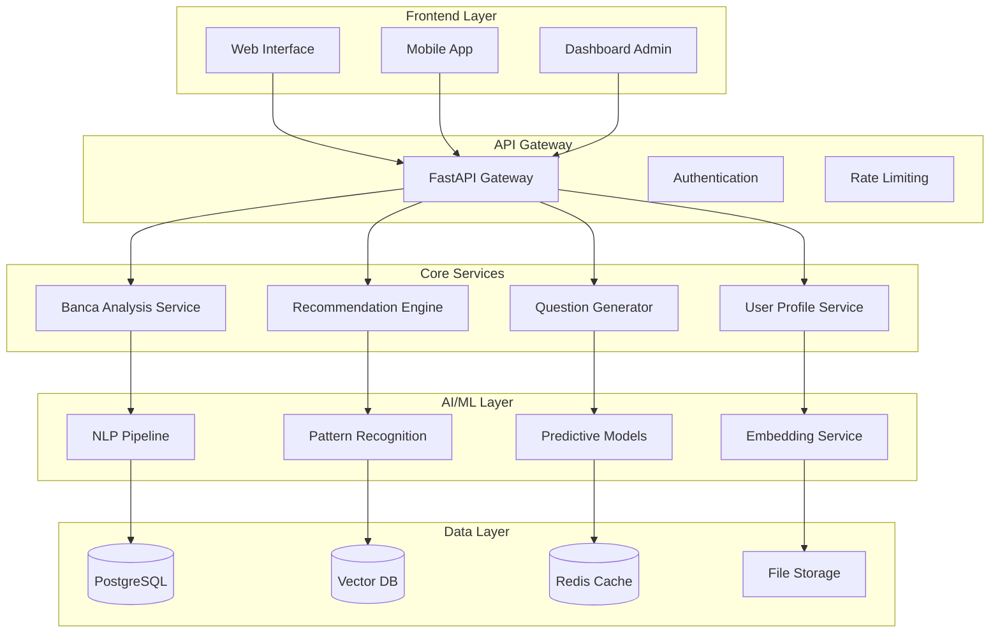

# 🏗️ ARQUITETURA TÉCNICA - ConcursAI

## 🎯 **OVERVIEW DA ARQUITETURA**

Sistema de IA especializado em análise de bancas de concursos com foco em personalização de estudos e predição de padrões de questões.

---

## 🏛️ **ARQUITETURA GERAL**



---

## 🧠 **SISTEMA DE IA E ML**

### **Pipeline de Processamento de Questões**

```python
# pipeline_questoes.py
class QuestionProcessingPipeline:
    def __init__(self):
        self.nlp_processor = NLPProcessor()
        self.feature_extractor = FeatureExtractor()
        self.banca_classifier = BancaClassifier()
        self.pattern_analyzer = PatternAnalyzer()
    
    def process_question(self, question_text, metadata):
        """Pipeline completo de processamento"""
        
        # 1. Pré-processamento NLP
        cleaned_text = self.nlp_processor.clean_text(question_text)
        tokens = self.nlp_processor.tokenize(cleaned_text)
        
        # 2. Extração de features
        linguistic_features = self.feature_extractor.extract_linguistic(tokens)
        content_features = self.feature_extractor.extract_content(cleaned_text)
        format_features = self.feature_extractor.extract_format(question_text)
        
        # 3. Classificação da banca
        banca_prediction = self.banca_classifier.predict({
            **linguistic_features,
            **content_features, 
            **format_features
        })
        
        # 4. Análise de padrões
        patterns = self.pattern_analyzer.analyze(
            text=cleaned_text,
            banca=banca_prediction['banca'],
            confidence=banca_prediction['confidence']
        )
        
        return {
            'banca': banca_prediction,
            'patterns': patterns,
            'features': {
                'linguistic': linguistic_features,
                'content': content_features,
                'format': format_features
            },
            'metadata': metadata
        }
```

### **Modelos de Machine Learning**

#### **1. Classificador de Bancas**
```python
# banca_classifier.py
from sklearn.ensemble import RandomForestClassifier
from sklearn.neural_network import MLPClassifier
import joblib

class BancaClassifier:
    def __init__(self):
        self.models = {
            'rf': RandomForestClassifier(n_estimators=100, random_state=42),
            'nn': MLPClassifier(hidden_layer_sizes=(100, 50), random_state=42)
        }
        self.ensemble_weights = {'rf': 0.6, 'nn': 0.4}
        self.feature_columns = self.load_feature_columns()
    
    def train(self, X_train, y_train):
        """Treina ensemble de modelos"""
        for name, model in self.models.items():
            model.fit(X_train, y_train)
            joblib.dump(model, f'models/{name}_banca_classifier.joblib')
    
    def predict(self, features):
        """Predição com ensemble voting"""
        predictions = {}
        probabilities = {}
        
        for name, model in self.models.items():
            pred = model.predict([features])[0]
            prob = model.predict_proba([features])[0]
            
            predictions[name] = pred
            probabilities[name] = prob
        
        # Ensemble voting
        final_prediction = self._ensemble_vote(predictions, probabilities)
        confidence = self._calculate_confidence(probabilities)
        
        return {
            'banca': final_prediction,
            'confidence': confidence,
            'individual_predictions': predictions
        }
```

#### **2. Sistema de Recomendação**
```python
# recommendation_engine.py
import numpy as np
from sklearn.metrics.pairwise import cosine_similarity

class RecommendationEngine:
    def __init__(self):
        self.user_profiles = {}
        self.banca_profiles = self.load_banca_profiles()
        self.similarity_matrix = None
    
    def build_user_profile(self, user_id, study_habits, performance_data):
        """Constrói perfil do usuário baseado em dados comportamentais"""
        profile = {
            'study_style': self._analyze_study_style(study_habits),
            'knowledge_areas': self._analyze_knowledge_areas(performance_data),
            'learning_pace': self._calculate_learning_pace(study_habits),
            'question_preferences': self._analyze_question_preferences(performance_data)
        }
        
        self.user_profiles[user_id] = profile
        return profile
    
    def recommend_banca(self, user_id):
        """Recomenda melhor banca baseada no perfil do usuário"""
        if user_id not in self.user_profiles:
            return self._default_recommendation()
        
        user_profile = self.user_profiles[user_id]
        similarities = {}
        
        for banca_name, banca_profile in self.banca_profiles.items():
            similarity = self._calculate_compatibility(user_profile, banca_profile)
            similarities[banca_name] = similarity
        
        # Ordena por compatibilidade
        ranked_bancas = sorted(similarities.items(), key=lambda x: x[1], reverse=True)
        
        return {
            'primary_recommendation': ranked_bancas[0],
            'all_recommendations': ranked_bancas,
            'explanation': self._generate_explanation(user_profile, ranked_bancas[0])
        }
```

#### **3. Preditor de Temas**
```python
# theme_predictor.py
from sklearn.ensemble import GradientBoostingRegressor
import pandas as pd

class ThemePredictor:
    def __init__(self):
        self.models = {}  # Um modelo por banca
        self.theme_categories = self.load_theme_categories()
    
    def train_predictive_model(self, banca_name, historical_data):
        """Treina modelo preditivo para uma banca específica"""
        
        # Preparação dos dados temporais
        df = pd.DataFrame(historical_data)
        df['date'] = pd.to_datetime(df['date'])
        df = df.sort_values('date')
        
        # Feature engineering temporal
        features = self._create_temporal_features(df)
        
        # Modelo para cada categoria de tema
        for theme in self.theme_categories:
            X = features
            y = df[f'{theme}_frequency']
            
            model = GradientBoostingRegressor(
                n_estimators=100,
                learning_rate=0.1,
                random_state=42
            )
            
            model.fit(X, y)
            self.models[f'{banca_name}_{theme}'] = model
    
    def predict_hot_themes(self, banca_name, prediction_horizon_days=90):
        """Prediz temas 'quentes' para os próximos concursos"""
        
        current_features = self._get_current_features()
        predictions = {}
        
        for theme in self.theme_categories:
            model_key = f'{banca_name}_{theme}'
            if model_key in self.models:
                pred = self.models[model_key].predict([current_features])[0]
                predictions[theme] = {
                    'predicted_frequency': pred,
                    'confidence': self._calculate_prediction_confidence(model_key),
                    'trend': self._calculate_trend(theme, banca_name)
                }
        
        # Ordena por probabilidade
        hot_themes = sorted(
            predictions.items(), 
            key=lambda x: x[1]['predicted_frequency'], 
            reverse=True
        )
        
        return hot_themes[:10]  # Top 10 temas mais prováveis
```

---

## 🗄️ **ESTRUTURA DE DADOS**

### **Schema do Banco de Dados**

```sql
-- users.sql
CREATE TABLE users (
    id UUID PRIMARY KEY DEFAULT gen_random_uuid(),
    email VARCHAR(255) UNIQUE NOT NULL,
    password_hash VARCHAR(255) NOT NULL,
    profile JSONB,
    subscription_type VARCHAR(50) DEFAULT 'free',
    created_at TIMESTAMP DEFAULT NOW(),
    updated_at TIMESTAMP DEFAULT NOW()
);

-- bancas.sql  
CREATE TABLE bancas (
    id SERIAL PRIMARY KEY,
    name VARCHAR(100) NOT NULL,
    full_name VARCHAR(255),
    characteristics JSONB,
    patterns JSONB,
    active BOOLEAN DEFAULT true
);

-- questions.sql
CREATE TABLE questions (
    id UUID PRIMARY KEY DEFAULT gen_random_uuid(),
    banca_id INTEGER REFERENCES bancas(id),
    content TEXT NOT NULL,
    subject VARCHAR(100),
    difficulty_level INTEGER,
    year INTEGER,
    exam_name VARCHAR(255),
    metadata JSONB,
    features JSONB,
    created_at TIMESTAMP DEFAULT NOW()
);

-- user_performance.sql
CREATE TABLE user_performance (
    id UUID PRIMARY KEY DEFAULT gen_random_uuid(),
    user_id UUID REFERENCES users(id),
    question_id UUID REFERENCES questions(id),
    answer_correct BOOLEAN,
    response_time_seconds INTEGER,
    confidence_level INTEGER,
    created_at TIMESTAMP DEFAULT NOW()
);

-- recommendations.sql
CREATE TABLE recommendations (
    id UUID PRIMARY KEY DEFAULT gen_random_uuid(),
    user_id UUID REFERENCES users(id),
    recommended_banca_id INTEGER REFERENCES bancas(id),
    compatibility_score DECIMAL(3,2),
    reasons JSONB,
    created_at TIMESTAMP DEFAULT NOW()
);

-- theme_predictions.sql
CREATE TABLE theme_predictions (
    id UUID PRIMARY KEY DEFAULT gen_random_uuid(),
    banca_id INTEGER REFERENCES bancas(id),
    theme VARCHAR(100),
    predicted_frequency DECIMAL(5,4),
    confidence_score DECIMAL(3,2),
    prediction_date DATE,
    target_period_start DATE,
    target_period_end DATE
);
```

### **Vector Database (Pinecone/Weaviate)**

```python
# vector_storage.py
class VectorStorage:
    def __init__(self):
        self.index_name = "concursai-questions"
        self.dimension = 384  # all-MiniLM-L6-v2
        
    def store_question_embedding(self, question_id, embedding, metadata):
        """Armazena embedding da questão com metadados"""
        vector_data = {
            'id': question_id,
            'values': embedding.tolist(),
            'metadata': {
                'banca': metadata['banca'],
                'subject': metadata['subject'],
                'year': metadata['year'],
                'difficulty': metadata['difficulty'],
                'patterns': metadata['patterns']
            }
        }
        
        self.index.upsert([vector_data])
    
    def find_similar_questions(self, query_embedding, banca_filter=None, top_k=10):
        """Busca questões similares"""
        filter_dict = {}
        if banca_filter:
            filter_dict['banca'] = banca_filter
        
        results = self.index.query(
            vector=query_embedding.tolist(),
            filter=filter_dict,
            top_k=top_k,
            include_metadata=True
        )
        
        return results['matches']
```

---

## 🚀 **APIs E MICROSERVIÇOS**

### **API Gateway Principal**

```python
# main.py - FastAPI
from fastapi import FastAPI, Depends, HTTPException
from fastapi.middleware.cors import CORSMiddleware
import uvicorn

app = FastAPI(
    title="ConcursAI API",
    description="API para análise inteligente de bancas de concursos",
    version="1.0.0"
)

app.add_middleware(
    CORSMiddleware,
    allow_origins=["*"],
    allow_credentials=True,
    allow_methods=["*"],
    allow_headers=["*"],
)

# Rotas principais
@app.post("/api/v1/analyze/question")
async def analyze_question(question: QuestionRequest):
    """Analisa uma questão e identifica a banca"""
    result = question_processor.process_question(
        question.content, 
        question.metadata
    )
    return result

@app.get("/api/v1/bancas/{banca_name}/profile")
async def get_banca_profile(banca_name: str):
    """Retorna perfil detalhado de uma banca"""
    profile = banca_service.get_profile(banca_name)
    if not profile:
        raise HTTPException(status_code=404, detail="Banca not found")
    return profile

@app.post("/api/v1/users/{user_id}/recommend")
async def recommend_banca(user_id: str, profile_data: UserProfileRequest):
    """Recomenda melhor banca para o usuário"""
    recommendation = recommendation_engine.recommend_banca(
        user_id, 
        profile_data.dict()
    )
    return recommendation

@app.get("/api/v1/predictions/{banca_name}/themes")
async def predict_themes(banca_name: str, days_ahead: int = 90):
    """Prediz temas mais prováveis para uma banca"""
    predictions = theme_predictor.predict_hot_themes(banca_name, days_ahead)
    return predictions
```

### **Microserviço de Análise de Bancas**

```python
# services/banca_analysis_service.py
class BancaAnalysisService:
    def __init__(self):
        self.nlp_pipeline = NLPPipeline()
        self.pattern_detector = PatternDetector()
        self.stats_calculator = StatsCalculator()
    
    async def analyze_banca_comprehensive(self, banca_name: str):
        """Análise completa de uma banca"""
        
        # Coleta questões da banca
        questions = await self.get_banca_questions(banca_name)
        
        # Análise estatística
        stats = self.stats_calculator.calculate_comprehensive_stats(questions)
        
        # Detecção de padrões
        patterns = await self.pattern_detector.detect_patterns(questions)
        
        # Análise temporal
        temporal_analysis = self.analyze_temporal_trends(questions)
        
        # Análise de dificuldade
        difficulty_analysis = self.analyze_difficulty_distribution(questions)
        
        return {
            'banca_name': banca_name,
            'total_questions_analyzed': len(questions),
            'statistics': stats,
            'patterns': patterns,
            'temporal_trends': temporal_analysis,
            'difficulty_distribution': difficulty_analysis,
            'last_updated': datetime.now().isoformat()
        }
    
    async def generate_study_plan(self, user_profile, target_banca):
        """Gera plano de estudos personalizado"""
        
        banca_analysis = await self.analyze_banca_comprehensive(target_banca)
        user_weaknesses = self.identify_user_weaknesses(user_profile)
        
        study_plan = {
            'target_banca': target_banca,
            'duration_weeks': 12,
            'weekly_schedule': self.create_weekly_schedule(
                banca_analysis, 
                user_weaknesses,
                user_profile['available_hours_per_week']
            ),
            'priority_subjects': self.calculate_priority_subjects(
                banca_analysis['patterns'],
                user_weaknesses
            ),
            'milestones': self.create_milestones(12),
            'recommended_resources': self.get_recommended_resources(target_banca)
        }
        
        return study_plan
```

---

## ⚡ **PERFORMANCE E ESCALABILIDADE**

### **Otimizações de Performance**

```python
# performance_optimizations.py
from functools import lru_cache
import asyncio
from concurrent.futures import ThreadPoolExecutor

class PerformanceOptimizer:
    def __init__(self):
        self.cache = RedisCache()
        self.executor = ThreadPoolExecutor(max_workers=4)
    
    @lru_cache(maxsize=1000)
    def cached_feature_extraction(self, question_hash):
        """Cache de features extraídas"""
        return self.feature_extractor.extract(question_hash)
    
    async def batch_question_processing(self, questions):
        """Processamento em lote para melhor performance"""
        
        tasks = []
        for question in questions:
            task = asyncio.create_task(
                self.process_question_async(question)
            )
            tasks.append(task)
        
        results = await asyncio.gather(*tasks)
        return results
    
    def parallel_model_inference(self, features_batch):
        """Inferência paralela nos modelos"""
        
        futures = []
        for features in features_batch:
            future = self.executor.submit(
                self.model.predict, 
                features
            )
            futures.append(future)
        
        results = [future.result() for future in futures]
        return results
```

### **Configuração de Deploy**

```yaml
# docker-compose.yml
version: '3.8'

services:
  api:
    build: .
    ports:
      - "8000:8000"
    environment:
      - DATABASE_URL=postgresql://user:pass@db:5432/concursai
      - REDIS_URL=redis://redis:6379
    depends_on:
      - db
      - redis
  
  db:
    image: postgres:13
    environment:
      POSTGRES_DB: concursai
      POSTGRES_USER: user
      POSTGRES_PASSWORD: pass
    volumes:
      - postgres_data:/var/lib/postgresql/data
  
  redis:
    image: redis:alpine
    ports:
      - "6379:6379"
  
  ml_worker:
    build: .
    command: celery worker -A tasks.celery_app
    depends_on:
      - redis
      - db

volumes:
  postgres_data:
```

---

## 🔐 **SEGURANÇA E MONITORAMENTO**

### **Sistema de Autenticação**

```python
# auth/security.py
from fastapi_users import FastAPIUsers
from fastapi_users.authentication import JWTAuthentication
import jwt

class SecurityManager:
    def __init__(self):
        self.jwt_secret = os.getenv("JWT_SECRET_KEY")
        self.algorithm = "HS256"
    
    def create_access_token(self, user_id: str, permissions: list):
        """Cria token JWT com permissões"""
        payload = {
            "user_id": user_id,
            "permissions": permissions,
            "exp": datetime.utcnow() + timedelta(hours=24)
        }
        
        token = jwt.encode(payload, self.jwt_secret, algorithm=self.algorithm)
        return token
    
    def validate_subscription(self, user_id: str, feature: str):
        """Valida se usuário tem permissão para feature"""
        user = self.get_user(user_id)
        
        feature_permissions = {
            'basic_analysis': ['free', 'premium', 'pro'],
            'advanced_predictions': ['premium', 'pro'],
            'coaching_ai': ['pro']
        }
        
        return user.subscription_type in feature_permissions.get(feature, [])
```

### **Monitoramento e Observabilidade**

```python
# monitoring/metrics.py
from prometheus_client import Counter, Histogram, Gauge
import logging

# Métricas Prometheus
api_requests_total = Counter('api_requests_total', 'Total API requests', ['method', 'endpoint'])
response_time = Histogram('response_time_seconds', 'Response time')
active_users = Gauge('active_users', 'Number of active users')
model_accuracy = Gauge('model_accuracy', 'ML model accuracy', ['model_name'])

class MetricsCollector:
    def __init__(self):
        self.logger = logging.getLogger(__name__)
    
    def track_api_call(self, method: str, endpoint: str, response_time: float):
        """Registra métricas de API"""
        api_requests_total.labels(method=method, endpoint=endpoint).inc()
        response_time.observe(response_time)
    
    def track_model_performance(self, model_name: str, accuracy: float):
        """Registra performance dos modelos"""
        model_accuracy.labels(model_name=model_name).set(accuracy)
        
        self.logger.info(f"Model {model_name} accuracy: {accuracy:.3f}")
```

---

## 📊 **ANALYTICS E BUSINESS INTELLIGENCE**

```python
# analytics/dashboard.py
class AnalyticsDashboard:
    def __init__(self):
        self.db = DatabaseConnection()
        self.cache = RedisCache()
    
    def generate_daily_report(self):
        """Relatório diário de uso da plataforma"""
        
        metrics = {
            'total_users': self.count_total_users(),
            'active_users_24h': self.count_active_users(hours=24),
            'questions_analyzed': self.count_questions_analyzed_today(),
            'recommendations_generated': self.count_recommendations_today(),
            'average_session_time': self.calculate_avg_session_time(),
            'top_bancas_searched': self.get_top_bancas_today(),
            'user_satisfaction_score': self.calculate_satisfaction_score()
        }
        
        return metrics
    
    def generate_ml_performance_report(self):
        """Relatório de performance dos modelos ML"""
        
        return {
            'banca_classifier_accuracy': self.get_model_accuracy('banca_classifier'),
            'recommendation_click_rate': self.calculate_recommendation_ctr(),
            'theme_prediction_accuracy': self.calculate_prediction_accuracy(),
            'false_positive_rate': self.calculate_false_positive_rate(),
            'model_inference_time': self.get_avg_inference_time()
        }
```

---

*Documentação Técnica - Versão 1.0 | Novembro 2025*
