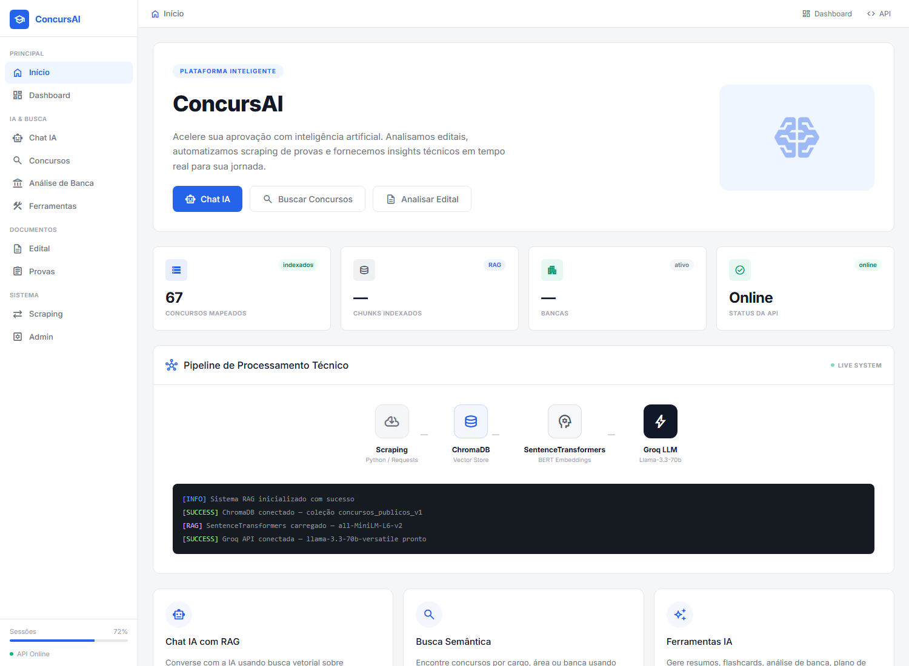
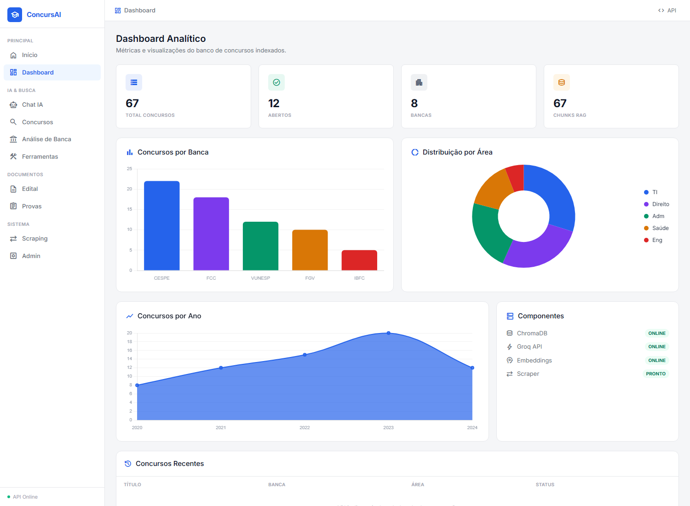
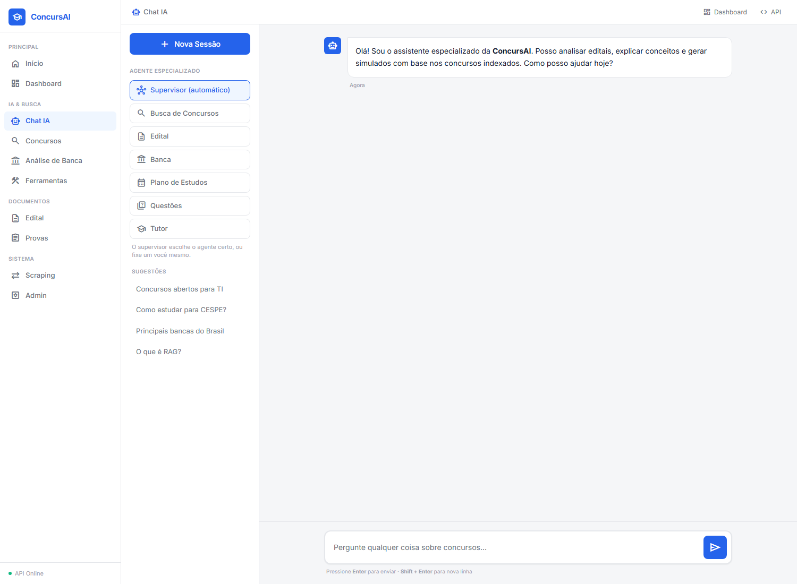
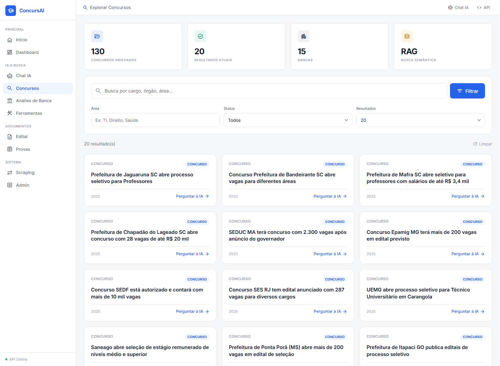
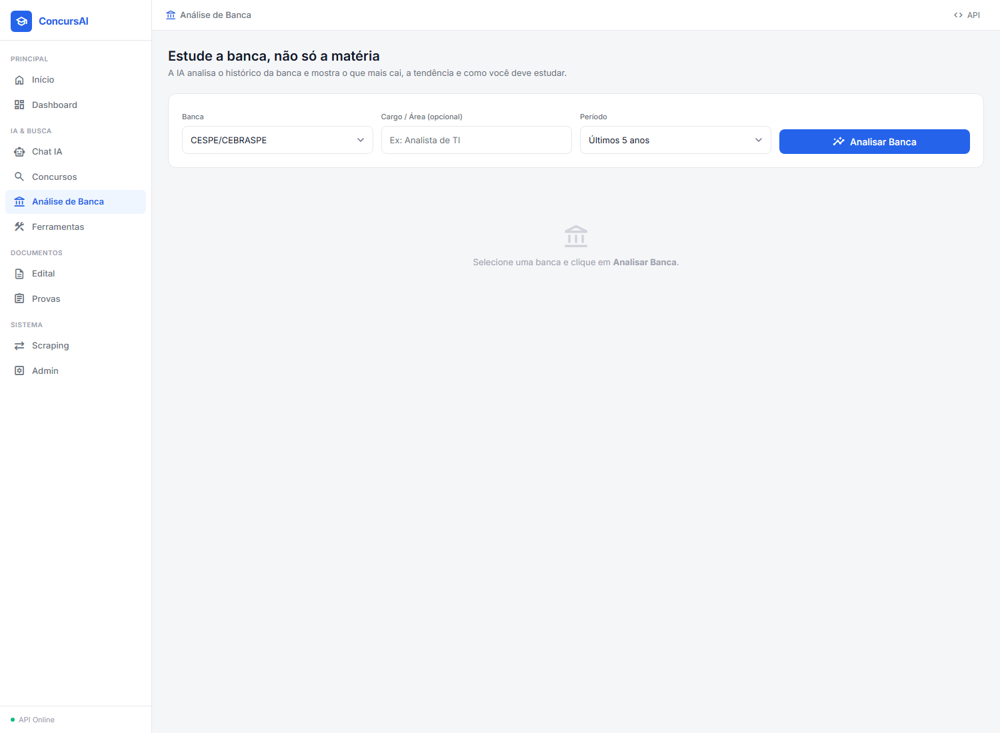
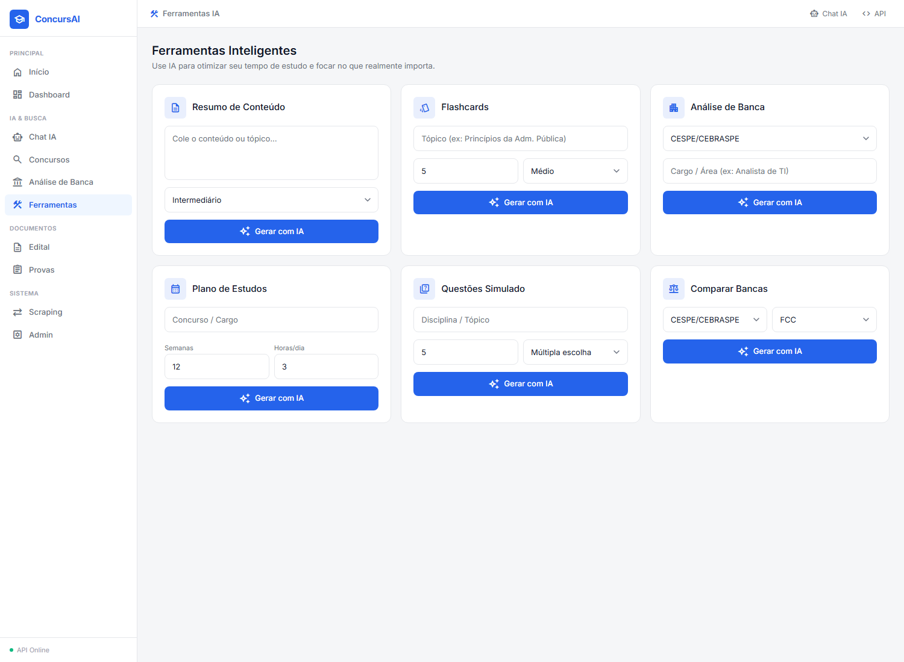
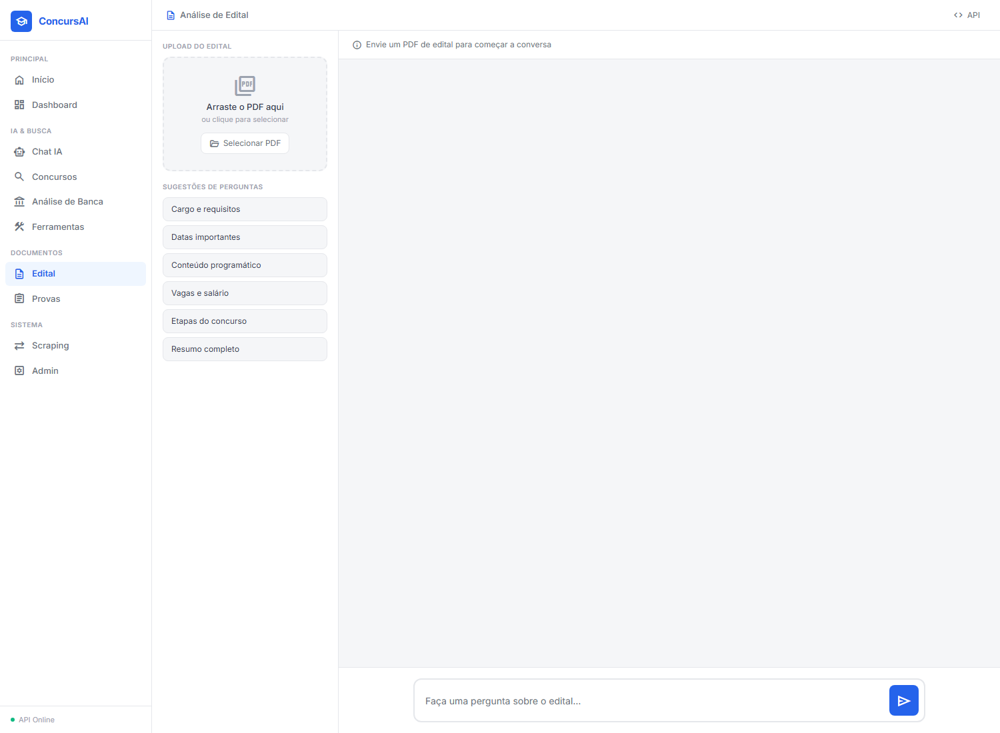
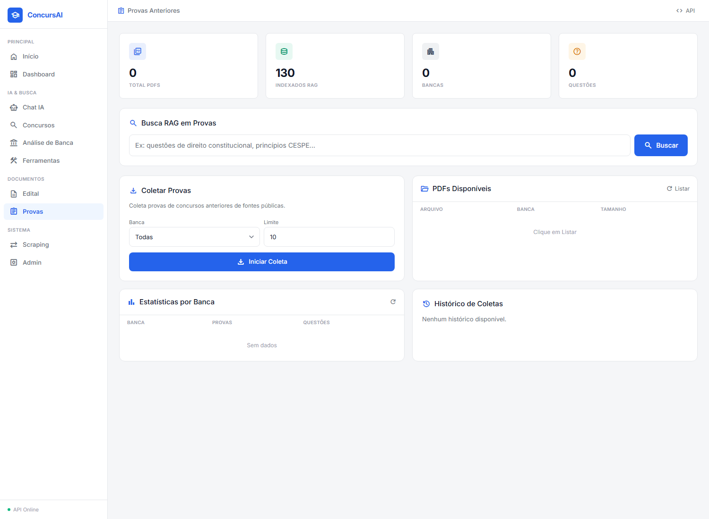
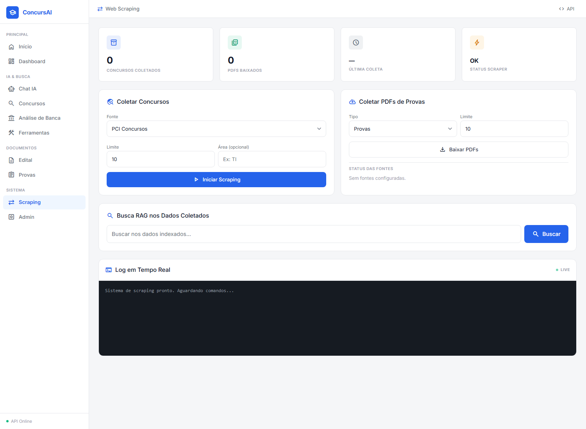
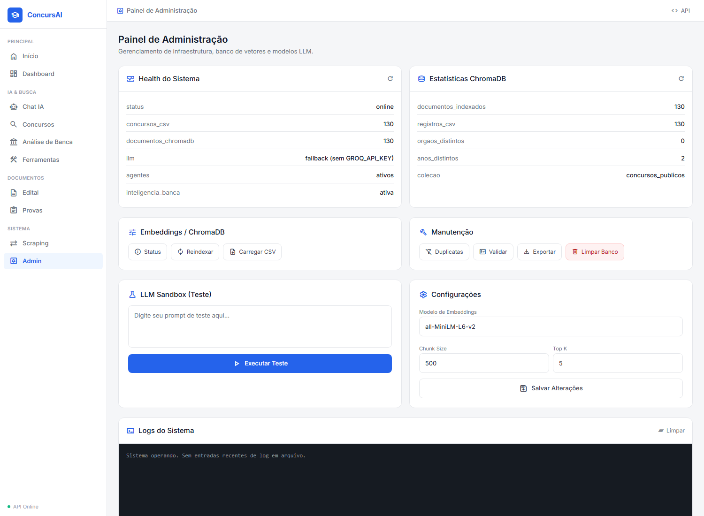

# Atualizações do ConcursAI

Registro das mudanças desta etapa do TCC: novo design, arquitetura de agentes
especializados, raspagem de concursos de 2026 e correções de backend.

---

## 1. Novo design (todas as 9 telas)

Sistema de design "Administrative Precision" (referência gerada no Stitch),
aplicado de forma consistente em todas as páginas com **Tailwind CSS** +
**Material Symbols**:

- Sidebar fixa (228px) com seções, ícones e item ativo em azul
- Topbar, hero, cards de estatística (ícone + badge + valor), cards de conteúdo
- Paleta: fundo `#f5f6f8`, superfícies `#ffffff`, azul de ação `#2563eb`
- Tipografia Inter; terminais/logs em JetBrains Mono

Páginas redesenhadas: `home`, `dashboard`, `chat`, `concursos`, `banca`,
`ferramentas`, `edital`, `provas`, `scraping`, `admin` (em `interfaces/pages/`),
com o sistema de design em `static/css/concursai.css`.

### Prints das telas

| Tela | Print |
|---|---|
| Início |  |
| Dashboard |  |
| Chat IA (agentes) |  |
| Concursos |  |
| Análise de Banca |  |
| Ferramentas |  |
| Edital |  |
| Provas |  |
| Scraping |  |
| Admin |  |

## 2. Arquitetura de Agentes Especializados (Supervisor + Skills)

Novo módulo `modules/agentes.py`. Um **agente Supervisor** classifica a intenção
da pergunta e roteia para o agente especializado correto. Cada agente tem uma
persona própria e decide se usa o RAG.

| Agente | Função | Usa RAG |
|---|---|---|
| 🔍 Busca de Concursos | vagas, salários, requisitos, prazos | sim |
| 📄 Edital | requisitos, etapas, conteúdo programático | sim |
| 🏛️ Banca | estilo e tendências da banca examinadora | sim |
| 📅 Plano de Estudos | cronograma de estudos personalizado | não |
| 📝 Questões | simulados com gabarito comentado | não |
| 👨‍🏫 Tutor | explicação didática de matérias | não |

- Roteador heurístico, determinístico e gratuito (ideal para demonstração).
- Cada persona tem o marcador `# «SEU PROMPT AQUI»` para inserir prompts próprios.
- Fallback gracioso: sem chave de IA, os agentes RAG ainda retornam resultados.

**Endpoints novos** (`api_fastapi.py`):
- `GET /agentes` — lista os agentes disponíveis
- `POST /agente/perguntar` — roteia e responde (`{pergunta, agente?, filtros, historico}`)

**Interface**: `chat.html` ganhou seletor de agente (Supervisor automático + 6
skills) e mostra qual agente respondeu.

## 3. Raspagem de concursos de 2026

Novo coletor `scrapers/coletar_2026.py` (o scraper antigo estava quebrado por
mudança na estrutura do site):

- Coleta da listagem de `concursosnobrasil.com`, filtra pelo ano, faz dedupe
  contra o `concursos_chunks.csv` e reconstrói a coleção no ChromaDB.
- Resultado: **63 concursos de 2026** adicionados → **130 documentos indexados**.
- Uso: `python scrapers/coletar_2026.py <ano> <paginas>`

## 4. Correções de backend

- **`responder_interface`**: argumentos estavam em ordem errada em
  `api_fastapi.py` — o RAG nunca recebia a pergunta. Corrigido.
- **`GET /concursos`**: quebrava (HTTP 500) com valores `NaN`/inteiros do CSV.
  Agora normaliza os campos para string.
- **`load_dotenv()`**: o app não carregava o `.env`. Adicionado no topo de
  `api_fastapi.py` (necessário para a `GROQ_API_KEY`).
- **`scrapers/pci_scraper_main.py`**: erro de indentação (código órfão) que
  impedia o servidor de iniciar. Removido.

## 5. MVP completo — telas consertadas + Inteligência de Banca

- **Inteligência de Banca** (`modules/banca_inteligencia.py`, `POST /banca/analisar`):
  a IA analisa o histórico da banca e gera a **incidência de temas** (o que mais
  cai nos últimos N anos, com tendência) + **perfil de estudo** + pegadinhas,
  ancorada no acervo raspado. Nova página `/pages/banca` com gráfico de
  incidência (Chart.js) e o perfil renderizado.
- **Ferramentas** agora têm backend real (`/ferramentas/resumo`, `flashcards`,
  `analise-banca`, `plano-estudos`, `questoes`, `comparar-bancas`) via IA.
- **Edital**: `POST /edital/upload` (lê o PDF) + `POST /edital/chat` (conversa
  sobre o documento) funcionando.
- **Provas**: `/api/provas/stats|listar|bancas|buscar|coletar` (o prefixo é
  `/api/provas` porque `/provas` é usado para servir os PDFs).
- **Admin**: `/health`, `/admin/stats`, reindexar/limpar ChromaDB, manutenção,
  logs, exportar CSV e `/chat/direto` (sandbox de LLM).

> A métrica de incidência é gerada pela IA a partir do conhecimento da banca e
> do acervo; fica mais precisa quanto mais provas forem raspadas e indexadas.
> A coleta em lote de provas em PDF roda via `scrapers/provas_scraper.py`.

## Como rodar a partir de um clone

```bash
git clone https://github.com/Fernandespilot/ConcursAI.git
cd ConcursAI

# 1. Dependências
pip install -r requirements.txt

# 2. Chave de IA (grátis em groq.com)
cp .env.example .env          # Windows: copy .env.example .env
#   edite o .env e preencha GROQ_API_KEY=...

# 3. Rodar (no 1º start baixa o modelo de embeddings e reindexa o ChromaDB)
python -m uvicorn api_fastapi:app --host 127.0.0.1 --port 8000
# abrir http://localhost:8000/pages/home
```

Notas:
- Os dados (`concursos_chunks.csv`) já vêm no repo; o índice `db_concursos/` é
  reconstruído sozinho no primeiro start.
- O 1º start precisa de internet (baixa o modelo `all-MiniLM-L6-v2`).
- Não é mais necessário `PYTHONUTF8=1` — o UTF-8 é configurado no código.
- **Sem a `GROQ_API_KEY`**, o app roda e os agentes RAG ainda retornam
  resultados (modo fallback); só as respostas elaboradas por IA ficam off.

> **Pendente do usuário:** colar os prompts próprios em `modules/agentes.py`
> (marcador `# «SEU PROMPT AQUI»`) para refinar as personas dos agentes.
